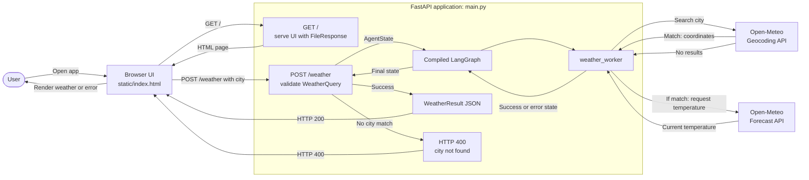
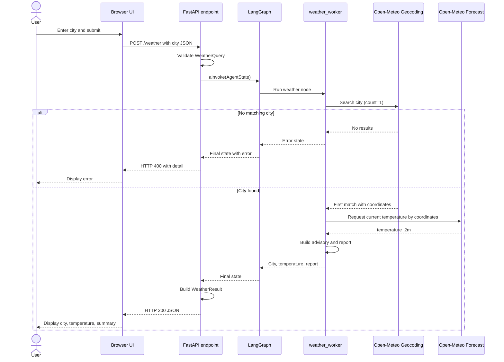

# FastAPI Weather Agent

A small asynchronous FastAPI service that looks up a city's current temperature using the free Open-Meteo geocoding and weather APIs. A one-node LangGraph workflow coordinates the lookup and creates a short weather advisory. No API key is required; the service needs internet access to reach Open-Meteo.

## Requirements

- Python 3.10 or newer
- Internet access while the application is running

## Environment Setup

Open a terminal in the project directory (the directory containing `main.py` and `requirements.txt`). Create and activate a virtual environment so the project packages are isolated from other Python projects.

### Windows PowerShell

```powershell
python -m venv .venv
.\.venv\Scripts\Activate.ps1
python -m pip install --upgrade pip
python -m pip install -r requirements.txt "uvicorn[standard]"
```

If PowerShell prevents activation because of the current execution policy, either activate the environment from Command Prompt with `.venv\Scripts\activate.bat` or run the interpreter and packages directly as `.venv\Scripts\python.exe`.

### macOS / Linux

```bash
python3 -m venv .venv
source .venv/bin/activate
python -m pip install --upgrade pip
python -m pip install -r requirements.txt "uvicorn[standard]"
```

## Run the API

From the project directory, with the virtual environment active:

```bash
python -m uvicorn main:app --reload
```

The server listens at `http://127.0.0.1:8000`. The `--reload` option restarts it when source files change; omit that option for a non-development run. Stop the server with `Ctrl+C`.

Open <http://127.0.0.1:8000> in a browser to use the Weather Desk UI. Enter a city and select **Check weather**; the page sends the city to the `POST /weather` endpoint and displays the result or an error. The API and UI are served by the same FastAPI process.

## UI and API Architecture

`main.py` serves `static/index.html` at `GET /`. The page submits the entered city as JSON to `POST /weather`; FastAPI runs the LangGraph workflow and returns either a weather result or an error. Since the UI and API share the same server and origin, no separate frontend server or CORS configuration is needed.



Interactive API documentation is available at:

- Swagger UI: <http://127.0.0.1:8000/docs>
- ReDoc: <http://127.0.0.1:8000/redoc>
- OpenAPI schema: <http://127.0.0.1:8000/openapi.json>

## Request the Weather

Send a JSON object with a `city` field to `POST /weather`.

### PowerShell

```powershell
$body = @{ city = "London" } | ConvertTo-Json
Invoke-RestMethod -Uri "http://127.0.0.1:8000/weather" -Method Post -ContentType "application/json" -Body $body
```

### macOS / Linux / curl

```bash
curl -X POST "http://127.0.0.1:8000/weather" \
	-H "Content-Type: application/json" \
	-d '{"city":"London"}'
```

A successful response has this shape (temperature and location depend on the current API data):

```json
{
	"city": "London, United Kingdom",
	"temperature_c": 18.4,
	"summary": "Current weather in London, United Kingdom: 18.4°C. Pleasant weather."
}
```

If geocoding returns no match, the endpoint responds with HTTP `400` and a detail such as:

```json
{
	"detail": "City 'NotARealCity' not found."
}
```

The request body is validated by FastAPI/Pydantic. For example, a missing `city` field or a value with the wrong type is rejected as an invalid request (`422`). Open-Meteo network or upstream errors may prevent a successful response.

## Request Workflow

This sequence shows one lookup from browser submission through the external API calls and back to the page:



Temperatures above 30°C produce the “Warm day, keep hydrated.” advisory; other temperatures produce “Pleasant weather.” A request with an invalid body is rejected by FastAPI with HTTP `422` before the LangGraph workflow starts. Open-Meteo network or upstream errors may also prevent a successful response.

## Project Files

```text
.
├── main.py          # FastAPI app, request/response models, and LangGraph workflow
├── static/
│   └── index.html   # Browser UI served at /
├── requirements.txt # Python package dependencies
└── README.md        # Setup and usage instructions
```
